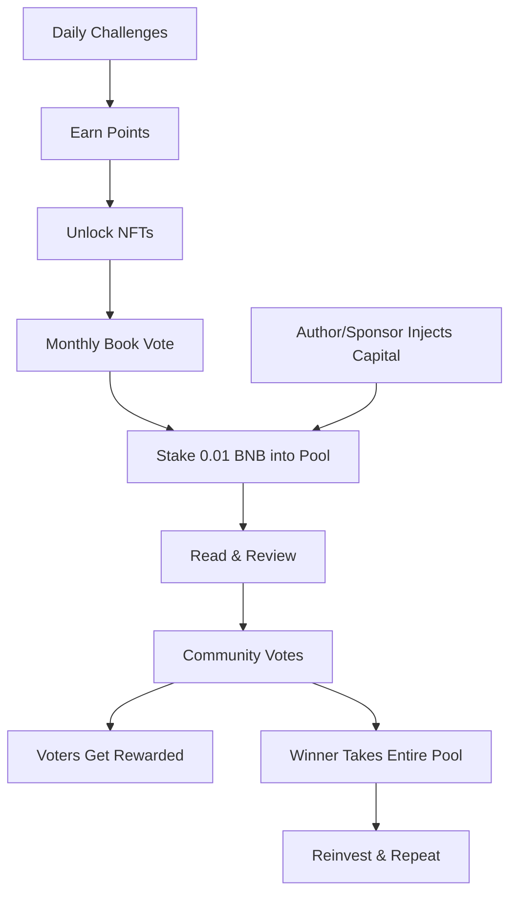

#  SquadBNB - Read, Earn, Belong

  
  
  
  
  

  <strong>Read with your squad. Earn with your mind.</strong>

---
## Project Overview

SquadBNB is a decentralized reading platform where book lovers form communities, participate in daily challenges, and earn real BNB rewards for their insights. Built on BNB Chain and integrated with Telegram, it transforms solitary reading into a shared, rewarding experience.

**Key Differentiators:**
- First reading economy on BNB Chain
- 900M+ Telegram users as target audience
- AI-powered engagement and recommendations
- Community-governed book selections
- Real BNB prize pools ( Currently Testnet Faucets )
---

## Live Demo

Try it out here:  
https://squadbnb-4.onrender.com/

Telegram Bot:  
https://t.me/SquadBnb_bot

---

##  The Problem

Millions read every day—alone, unrewarded, disconnected. Book clubs die after one meeting. Reviews vanish into the void. And the value readers create? Extracted by platforms, never shared with the people who actually did the reading.

Web3 built a financial revolution. We're building a cultural one.

---

##  The Solution: SquadBNB

SquadBNB transforms reading from a solitary hobby into a **community-owned economy**. Inside Telegram, readers form squads, govern monthly book selections, compete for prizes, and get paid for their insights.

**No app download. No wallet confusion. Just pure, rewarding reading.**

---

##  How It Works

###  1. Join or Create a Squad
Pick your genre—Fantasy, Sci-Fi, Philosophy, Romance, Mystery, Self-Help. Find your people. Your squad, your vibe.

**One tap inside Telegram. MetaMask connects automatically. You're in.**

---

###  2. Daily Challenges (Your Warm-Up)
Every day, AI generates a unique challenge tailored to your squad's genre:
-  Snap a photo of your current page
-  Share a quote that moved you
-  Answer a thought-provoking prompt

**Submit daily. Earn points. Build streaks. Unlock NFT badges.**

| Badge | Unlock Condition |
|-------|------------------|
|  **Novice Reader** | First submission |
|  **Bookworm** | 5 Submissions |
|  **Scholar** | 10 Submissions |
|  **Sage** | 25 Submissions |
|  **Master Reader** | 50 Submissions |
|  **Legend** | 100 Submissions |

**These NFTs are yours forever—on-chain proof of your reading journey.**

---

###  3. Propose & Vote on Monthly Books
Every month, squad members propose books they want to read together. The community votes. The book with the highest votes wins.

> *"I want to read Dune with my sci-fi squad this month. Let's see if the community agrees."*

---

###  4. Pool the Prize
Everyone who joins the monthly challenge contributes a small amount—0.01 BNB. These contributions **pool together** to form the prize purse.

**Authors, publishers, or sponsors can also add to the pool.** Imagine your favorite author dropping BNB into your squad's prize fund.

---

###  5. Read & Review
A month of reading. A month of thinking. A month of growing together.

At month's end, members post their **reviews, insights, and takeaways**.

---

###  6. Vote on the Best
The squad votes. Which review made you think differently? Which insight blew your mind?

**Here's the magic:** Voters get **incentives for voting fairly**. No bots. No gaming. Just real readers rewarding real insights.

---

###  7. Winner Takes the Pool
The reader with the highest-voted review claims the entire prize pool. Their insight just paid off—literally.

---

##  NFT Badge Collection
| Badge | Unlock Condition |
|-------|------------------|
|  **Novice Reader** | First submission |
|  **Bookworm** | 5 Submissions |
|  **Scholar** | 10 Submissions |
|  **Sage** | 25 Submissions |
|  **Master Reader** | 50 Submissions |
|  **Legend** | 100 Submissions |

**Every badge is minted on BNB Chain. Permanent. Provable. Yours.**

---

##  The AI Companion

Meet your personal reading assistant—**right inside Telegram**.

| Ask | Get |
|-----|-----|
|  "Recommend me a fantasy book like Name of the Wind" | Curated book suggestions |
|  "Which sci-fi squads are most active?" | Squad matching based on your interests |
|  "What's the prize pool in Philosophy squad this month?" | Live economic data |
|  "Match me with squads where my review style wins" | AI-powered squad recommendations |

**The AI doesn't just recommend books. It helps you maximize your earnings.**

---

##  The Economic Flywheel

---

##  Future Enhancements

SquadBNB is more than a book platform — it’s a reusable coordination model for any interest-based community.

- Cooking Squads
 
- Acting Squads

- Wellness Squads  

- Art Squads

- Science Squads

- Gaming Squads

> The model scales to any passion-driven community — stake, participate, vote, reward, repeat.

---

## Documentation

- [Project Vision & Roadmap](docs/PROJECT.md)
- [Technical Architecture & Setup](docs/TECHNICAL.md)
- [Demo Video & Pitch Deck](docs/EXTRAS.md)

---

## Team

Heeral Mandolia
(Developer)

