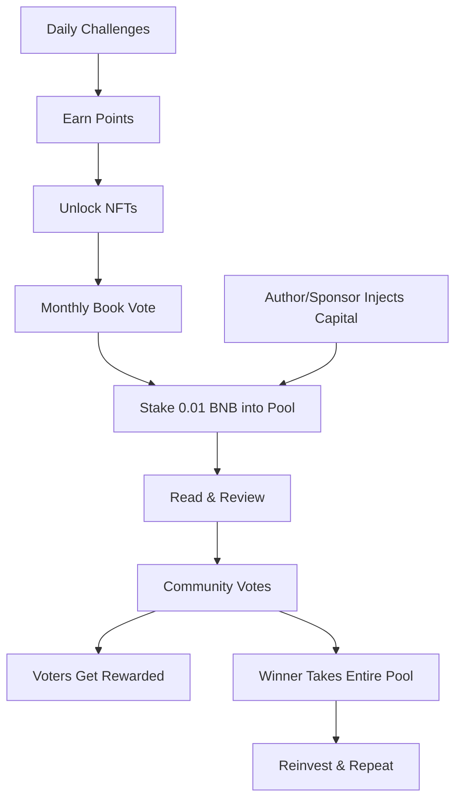

# Project: Problem, Solution & Impact

---

## 1. Problem

### People Perform Better in Squads — But Reading Has None

Humans are more consistent, motivated, and productive inside aligned communities.

- Study groups outperform solo learners  
- Fitness improves with accountability partners  
- Builders ship faster in teams  

Community creates momentum.  
Accountability creates consistency.  
Shared incentives create commitment.

Yet reading — one of the world’s most common intellectual activities — happens almost entirely alone.

---

### Readers Are Alone in a Crowded World

2.3 billion people read daily, yet most do it in isolation.

They generate insights.  
They write thoughtful reviews.  
They recommend books that drive sales.

But those insights disappear into centralized platforms.

Knowledge is created.  
Platforms capture the value.  
Readers receive none of the upside.

Reading is globally popular — yet socially disconnected and economically unrewarded.

---

### Book Clubs Fail Structurally

Traditional book clubs attempt community — but lack infrastructure.

| Problem | Why It Fails |
|----------|--------------|
| Scheduling conflicts | Meetings are hard to coordinate |
| Commitment fades | Attendance drops quickly |
| No accountability | Members stop reading |
| No incentives | No reason to stay engaged |

Without economic alignment or structured engagement loops, most book clubs dissolve.

---

### No Incentive. No Accountability. No Ownership.

Modern reading lacks three core drivers of sustained behavior:

- **Accountability** – No structured commitment mechanism  
- **Incentives** – No financial upside for insight or participation  
- **Ownership** – No proof of progress or reputation  

Meanwhile, Web3 focused primarily on financial primitives, leaving cultural contributors behind.

2.3 billion readers + 900 million Telegram users represent one of the largest untapped coordination layers in Web3.

The opportunity is not to convince people to read.  
They already do.

The opportunity is to give them a reason to read together.

---

## 2. Solution

### Core Thesis

Reading should not be solitary.  
Reading should not be unrewarded.  
Reading should not be owned by extractive platforms.

SquadBNB transforms reading from a passive hobby into an active, community-owned economy.

---

### How SquadBNB Fixes It

| Problem | SquadBNB Solution |
|----------|------------------|
| No community | Genre-based squads inside Telegram |
| No accountability | Stake to join, earn to win |
| No rewards | Real BNB prize pools |
| No habit formation | Daily AI challenges with streak tracking |
| No ownership | NFT badges proving participation |
| No governance | Monthly book voting |

---

### User Journey

---

## Habit Formation Through Incentives

### Mechanisms & Why They Work

| Mechanism | Why It Works |
|-----------|--------------|
| Daily challenges | Small wins create reinforcement |
| Streak tracking | Encourages consistency |
| Staking | Skin in the game increases commitment |
| Voting rights | Ownership drives engagement |
| BNB rewards | Real value builds lasting habits |

This system aligns behavioral psychology with on-chain incentives.

---

## Earn While You Read

| Activity | Reward |
|----------|--------|
| Complete daily challenge | Points + streak progress |
| Get verified by squad | Bonus points |
| Vote on monthly book | Voting incentives |
| Stake into prize pool | Eligibility to win |
| Submit best review | Entire prize pool |
| Vote honestly | Share of voting rewards |

Participation compounds.  
Quality contributions increase earning potential.

---

## Fairness Mechanisms

| Safeguard | Implementation |
|-----------|----------------|
| One person, one vote | Squad-based governance |
| Voter incentives | Rewards for honest voting |
| Peer verification | Community validation |
| Staking caps | Prevent whale dominance |
| Transparent pools | On-chain visibility |

---

## 3. Business & Ecosystem Impact

### Target Users

- Readers seeking accountability and community  
- Authors seeking engagement and distribution  
- Publishers seeking measurable, active audiences  

Adoption begins with genre-based squads inside Telegram and expands through organic community growth.

---

### Value to the Ecosystem

**For Users:**

- Earn BNB for participation  
- Build verifiable on-chain reputation  
- Develop consistent reading habits  

**For BNB Chain:**

- Cultural use case beyond DeFi  
- High-frequency micro-transactions  
- Increased wallet activity  
- NFT-driven reputation systems  

**For Developers:**

- Modular squad-based coordination model  
- Expandable vertical framework  

---

### Monetization & Sustainability

- 2% protocol fee on prize pools  
- Sponsored prize pool injections  
- Premium squad features  
- Future governance token  

The model scales with engagement.

---

## 4. Limitations & Future Work

### Current Limitations

- Early-stage user base  
- Testnet-based reward experimentation  
- Need for robust Sybil resistance  

---

### Short-Term Roadmap

- Improve anti-bot verification  
- Expand squad categories
- Add AI Verification for fake reviews/challenges
- Enhance AI challenge personalization  
- Optimize voting incentive mechanism  

---

### Long-Term Vision

- Multi-vertical expansion (cooking, art, wellness, gaming, science)  
- Cross-squad reputation scoring  
- Governance token launch  
- Deep publisher and author integrations  

---

## Call to Action

Try it now:  
https://t.me/SquadBnb_bot  

Web App:  
https://squadbnb-4.onrender.com  

GitHub:  
https://github.com/Heeral03/SquadBNB  

Join a squad. Stake. Participate. Earn.
