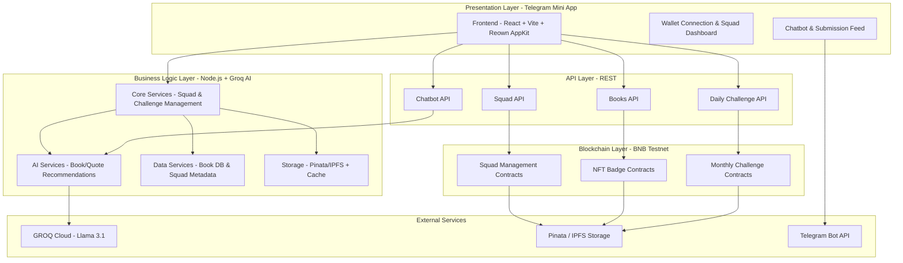
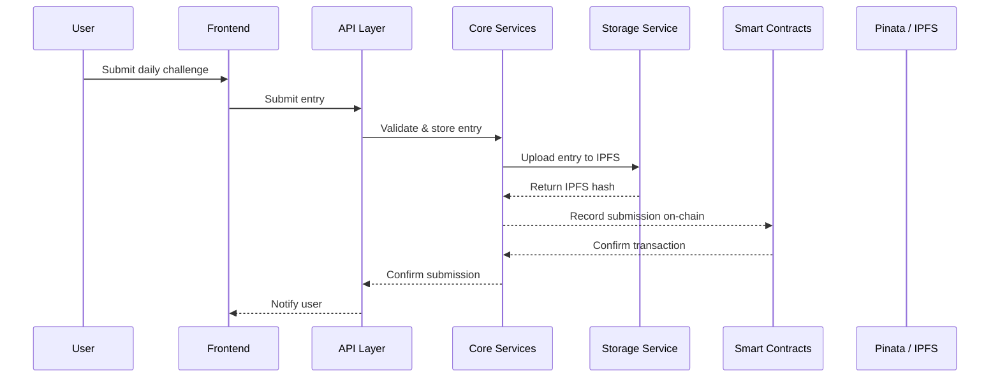
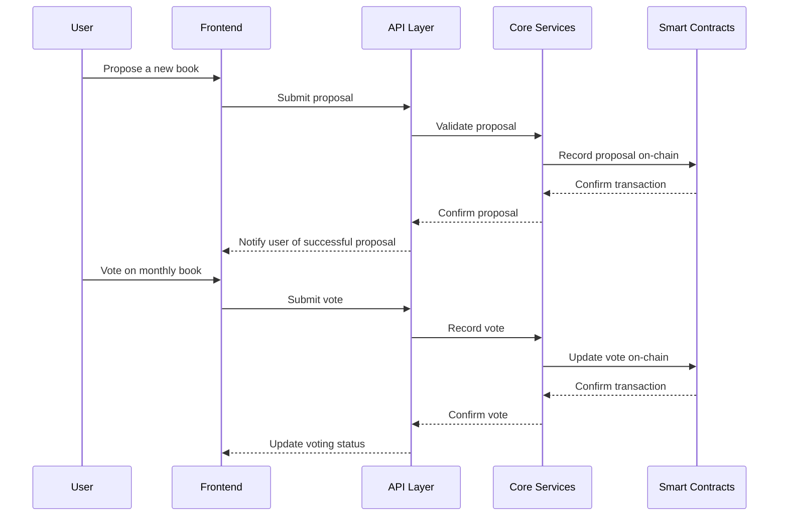
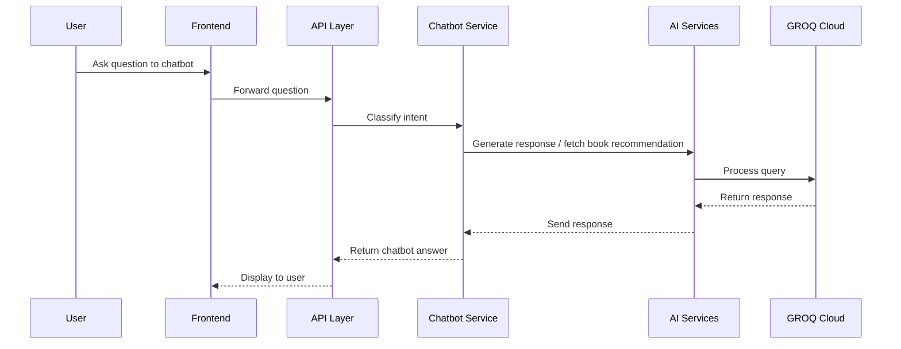
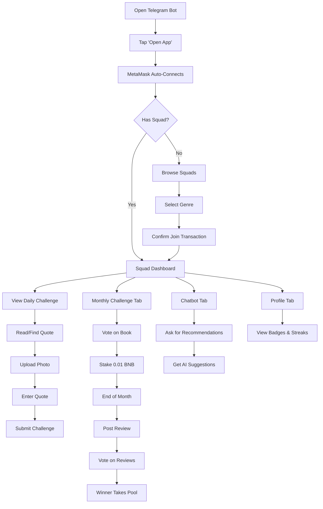

# 1. SquadBNB Architecture Overview

This diagram represents the end-to-end architecture of SquadBNB, from user interaction in Telegram to on-chain smart contracts and external services.

---

## System Architecture Flow




--- 


## Sequence Diagram

### Daily Challenges


---

### Monthly Challenges


---

### Chatbot Flow


---

## On Chain Vs Off Chain
| Component             | Location                  | Rationale                                           |
|-----------------------|---------------------------|----------------------------------------------------|
| Squad Membership      | On-chain (SquadManager)   | Immutable record, trustless verification          |
| User Points & Streaks | On-chain                  | Transparent, verifiable, can't be manipulated    |
| NFT Badges            | On-chain (ERC-721)        | Permanent ownership, tradable assets              |
| Prize Pools           | On-chain                  | Transparent, automated distribution               |
| Votes                 | On-chain                  | Immutable, verifiable, sybil-resistant           |
| Daily Challenges      | Off-chain (Backend)       | Dynamic, AI-generated, changes daily             |
| Book Recommendations  | Off-chain (Groq)          | Requires ML models, constant updates             |
| User Photos           | Off-chain (IPFS)          | Storage efficiency, cost-effective               |
| Squad Categories      | Off-chain (JSON)          | Frequently updated, no need for consensus        |
| Chatbot Conversations | Off-chain (Groq)          | Real-time, high-frequency, low-stakes            |

---

## Security Considerations
| Risk                     | Mitigation Strategy                                           |
|--------------------------|---------------------------------------------------------------|
| Reentrancy Attacks       | Checks-Effects-Interactions pattern, reentrancy guards       |
| Vote Manipulation        | Voter incentives for honesty, quadratic voting mechanisms    |
| Private Key Exposure     | Environment variables, hardware wallet support               |
| API Key Leakage          | Environment variables, regular rotation                      |
| Input Validation         | Sanitize all user inputs, parameterized queries              |
| Gas Optimization         | Efficient contract design, batch operations                  |

---

## Scalability Considerations
| Aspect                  | Strategy                                                          |
|-------------------------|-------------------------------------------------------------------|
| User Growth             | Telegram's infrastructure handles 900M+ users; our backend scales horizontally |
| Transaction Volume      | BNB Chain handles 100+ TPS; batching transactions where possible |
| Data Storage            | IPFS for media; on-chain only for critical state; caching layer for reads |
| AI Queries              | Groq's fast inference; response caching for common queries       |
| Concurrent Users        | Load balancing, auto-scaling on Render                           |

---

## 2. Setup & Run

### Prerequisites

| Requirement      | Version | Purpose                              |
|-----------------|--------|--------------------------------------|
| Node.js          | v18+   | Runtime for backend and frontend     |
| npm              | v9+    | Package manager                      |
| MetaMask         | Latest | Browser wallet for BSC Testnet       |
| BSC Testnet BNB  | Free   | Gas fees (Faucet)                    |
| Git              | Latest | Version control                      |
| Pinata Account   | Free   | IPFS storage (Sign up)               |
| Groq API Key     | Free   | AI services (Get key)                |
| Telegram Account | Free   | Bot access                           |

---

### Environment Setup

**Backend** (create `/backend/.env`):

```bash
PORT=3000
GROQ_API_KEY=your_groq_api_key_here
NODE_ENV=development
```
**Frontend (create /frontend/.env):**

```bash
VITE_PROJECT_ID=32def5fb70a93f87342883d31a7769d3
VITE_OPBNB_RPC=https://opbnb-testnet-rpc.bnbchain.org
VITE_BOT_TOKEN=your_telegram_bot_token
VITE_PINATA_API_KEY=your_pinata_api_key
VITE_PINATA_SECRET_API_KEY=your_pinata_secret
VITE_PINATA_JWT=your_pinata_jwt
VITE_API_URL=http://localhost:3000
```
### Install and Build
```bash
# Clone repository
git clone https://github.com/Heeral03/SquadBNB.git
cd SquadBNB

# Backend setup
cd backend
npm install
cp .env.example .env
# Edit .env with your actual API keys

# Frontend setup
cd ../frontend
npm install
cp .env.example .env
# Edit .env with your actual keys

# Smart contracts (optional - for development)
cd ../blockchain
npm install
forge build
```

### Run Locally
```bash
# Terminal 1 - Backend:
cd backend
node index.js

# Terminal 2 - Frontend:

cd frontend
npm run dev
```

---

## 3. Demo Guide

### Access the App

| Method              | Link / Command                       |
|--------------------|--------------------------------------|
| Telegram Bot        | [@SquadBnb_bot](https://t.me/SquadBnb_bot) |
| Web App (Live)      | [https://squadbnb-4.onrender.com](https://squadbnb-4.onrender.com) |
| Local Development   | [http://localhost:5173](http://localhost:5173) |

---

### Step-by-Step Demo

| Step | Action                                      | Expected Outcome                              |
|------|---------------------------------------------|-----------------------------------------------|
| 1    | Open @SquadBnb_bot on Telegram             | Bot welcome message appears                   |
| 2    | Tap "Open SquadBNB" button                 | App loads with splash animation              |
| 3    | MetaMask popup appears                      | Click "Connect" and sign                      |
| 4    | Wallet address shows in header             | Connection successful                         |
| 5    | Navigate to Squads tab                     | List of available squads                      |
| 6    | Click "Join" on a squad (e.g., "Nolans")  | MetaMask transaction prompt                   |
| 7    | Confirm transaction                        | Squad joined, points show                     |
| 8    | Go to Daily tab                             | AI-generated challenge appears                |
| 9    | Click to upload a book photo                | File picker opens                             |
| 10   | Select photo                                | Preview appears                               |
| 11   | Enter a meaningful quote                    | Character count updates                        |
| 12   | Click "Submit Challenge"                    | Loading state → Success toast                 |
| 13   | Go to Feed tab                               | Your submission appears                        |
| 14   | Go to Profile tab                            | Points, streak, badges shown                  |
| 15   | Click chatbot icon                           | Chat window opens                              |
| 16   | Ask: "Recommend me fantasy books"           | AI book suggestions appear                     |
| 17   | Ask: "Which squads can I join?"             | Squad recommendations                          |
| 18   | Go to Monthly tab                            | Current book proposals                         |
| 19   | Vote on a book                              | Vote recorded                                  |
| 20   | Check transaction on BSCScan                | Contract verified                              |

---

### Key Actions to Demonstrate

| Action                  | Why It Matters                                   |
|-------------------------|--------------------------------------------------|
| Connect wallet          | Shows seamless Telegram + Web3 integration      |
| Join squad              | Demonstrates community-building mechanism      |
| Submit daily challenge  | Shows AI engagement + IPFS storage             |
| Check profile badges    | Shows on-chain achievement system              |
| Ask AI chatbot          | Shows personalized recommendations             |
| Vote on monthly book    | Shows governance mechanism                      |
| View feed               | Shows peer verification system                  |

---

### Expected Outcomes

| Stage                    | What User Sees                               |
|--------------------------|----------------------------------------------|
| After connecting          | Dashboard with stats, squad info             |
| After joining squad       | Squad name in header, points: 0 → 10         |
| After daily submission    | Points increase, streak starts               |
| After 7-day streak        | "Bookworm" NFT badge appears                 |
| After monthly vote        | Vote confirmation, pool updates              |
| After AI chat             | Relevant book/squad suggestions              |
| After winning             | BNB arrives in wallet, NFT badge minted      |

---

### User Flow Diagram




